# HTML5 정리

## 1. 2 HTML5 Introduction & Syntax (HTML5 기본 문법)

1. HTML (HyperText Markup Language) : 웹페이지를 기술하기 위한 마크업 언어

   1. 웹페이지의 내용(content)와 구조(structure)를 담당하는 언어로써 HTML 태그를 통해서 정보를 구조화
   2. 반드시 <!DOCYPE html>로 시작해서 문서 형식을 지정
   3. 웹브라우저에 출력되는 모든 요소는 <body> </body> 사이에 위치

   ```html
   <!DOCTYPE html>
   <html>
     <head>
       <meta charset="utf-8" />
       <title>Hello World</title>
     </head>
     <body>
       <h1>Hello World</h1>
       <p>안녕하세요! HTML5</p>
     </body>
   </html>
   ```

1. HTML의 기본 문법

   1. 요소 (Element)

      → HTML 요소는 시작 태그(start tag)와 종료 태그(end tag) 그리고 태그 사이에 위치한 content로 구성

   .png>)
   → 요소는 중첩 가능 (다른 요소를 포함 가능) : 부자관계로 정보를 구조화하는 것

   → 빈 요소 (Self-Closing element) : attribute 만을 가질 수 有 (content가 X)

   ex) br, hr, img, input, link, meta 태그

1. 속성 (attribute)

   → 요소의 성질, 특징을 정의하는 명세

   → 시작 태그에 위치해야하며, 이름과 값의 쌍을 이룸

   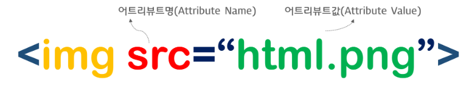

---

## 1.3 Semantic Web (시맨틱 요소와 검색 엔진)

1. Semantic Tag & Non-semantic Tag

   1. Semantic Tag : 브라우저, 검색엔진, 개발자 모두에게 content의 의미를 명확히 설명하는 역할

      → ex) form, table, img, article(본문의 주내용이 들어가는 공간을 의미) , section (본문의 여러 내용을 포함하는 공간을 의미), header(헤더를 의미)

   2. Non-Semantic Tag : content에 대한 어떠한 설명도 하지 X

      → ex) div, span 등

      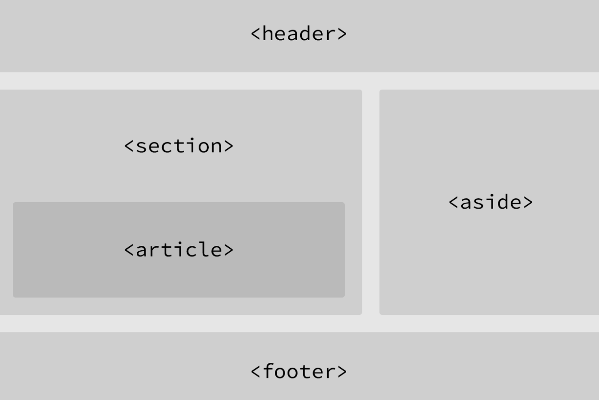

      원하는 위치에 따른 Semantic Tag 사용하기

   ***

   ## 1.4 HTML Tag - Basic (웹페이지를 구성하는 기본 태그)

   1. 문서 형식 정의를 하는 Tag

      → 출력한 웹 페이지의 형식을 브라우저에 전달

      → 문서의 최상위에 有

      ```html
      <!DOCTYPE html>
      ```

   2. html tag

      → 모든 HTML 요소의 부모 요소 & 웹페이지에 단 하나만 존재

      → 모든 요소들은 html 요소의 자식 요소이며, html 요소 내부에 기술되어야함

      → 단, <!Doctype html>은 예외

      ```html
      <!DOCTYPE HTML>
      <html>
        <head>
          <meta charset="utf-8">
      		<html lang="ko">
          <title>문서 제목</title>
        </head>
        <body>
          화면에 표시할 모든 콘텐츠는 이곳에 기술한다.
        </body>
      </html>
      ```

   3. head tag <head> </head>

      → 화면에 표시되지 않는 요소들 정의하는 부분

      → HTML 문서의 title,style, link, script에 대한 데이터로 화면에 표시되지 X

      1. title tag

         → 문서의 제목을 정의 / 정의된 제목은 브라우저의 탭에 표시됨

         ```html
         <title>문서 제목</title>
         ```

      2. style tag

         → css와 관련된 내용들을 새로운 파일에 작성하지 X고, html 문서 내부에 작성 시

         → <head> </head> 안에 작성됨

         ```html
         <style>
           body {
             background-color: yellow;
             color: blue;
           }
         </style>
         ```

      3. link tag

         → 외부 리소스와의 연계 정보를 정의 (주로 html과 외부 CSS 파일을 연계 시)

         → <head> </head> 안에 작성됨

         ```html
         <link rel="stylesheet" href="style.css" />
         ```

      4. script tag

         → 외부 client-side Javascript를 정의시

         ```html
         <script>
           document.addEventListener("click", function () {
             alert("Clicked!");
           });
         </script>
         ```

         ```html
         <script src="main.js"></script>
         ```

   4. body tag

      → HTML 문서의 내용을 나타냄

   ***

## 1.5 HTML Tag - Text

1. 제목 (headings) 태그

   → 제목을 나타낼 때 사용하는 태그 (h1~h6 까지 존재)

2. 글자 형태 태그

   1. b : bold 체를 지정

      ```html
      <b>This text is bold.</b>
      ```

   2. i : 이텔릭체를 지정

      ```html
      <i>This text is italic.</i>
      ```

   3. small : 작은 글씨를 제공

      ```html
      <h2>HTML <small>Small</small> Formatting</h2>
      ```

   4. mark : highlighted text를 제공

      ```html
      <h2>HTML <mark>Marked</mark> Formatting</h2>
      ```

   5. del : 삭제되었다는 표시인 중간에 줄 그어진 text를 제공

      ```html
      <p>My favorite color is <del>blue</del> red.</p>
      ```

3. 본문 태그
   1. p : 단락 (paragraphs)를 지정
   2. br : 강제 개행을 지정
   3. pre : 작성한 그대로 브라우저에 표시됨
   4. hr : 수평한 줄을 삽입
      <br>
      <br>

---

# 5주차 과제 CSS 정리

## CSS 1~4 & 7~9 정리

---

## 2.1 CSS Syntax - CSS 기본 문법

→ HTML의 각 요소(Element)의 style를 정의하여 화면에 어떻게 보여주면 되는지를 알려주는 언어

### 1. Selector (선택자)

→ 스타일을 적용하고자 하는 HTML 요소를 선택

( ∵ CSS는 HTML 요소의 style를 정의하는 데 사용되니까)

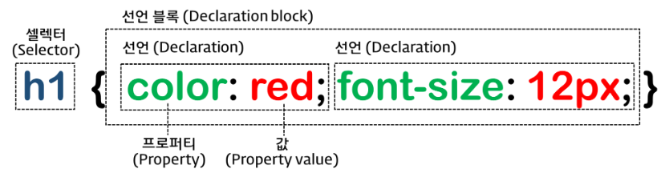

→ selector를 통해 선택된 특정 HTML 요소를 어떻게 스타일 할건지를 브라우저에 지시하는 역할

### 2. Property (속성)

→ selector로 HTML 요소를 사용하고 { } 내에 속성과 값을 지정하는 것으로 다양한 style 정의

→ 각각의 property들을 ; 를 통해서 구분

```css
p {
  color: ...;
  font-size: ...;
}
```

### 3. 값 (value)

---

## 2.2 CSS Selector - 셀렉터

→ style를 적용하고자 하는 HTML 요소를 특정하는 것

### 1. **복수개의 selector를 연속해서 지정할 수 있으며, ( , )로 구분함**

```css
h1,
p {
  color: red;
}
```

### 2. **Selector의 종류**

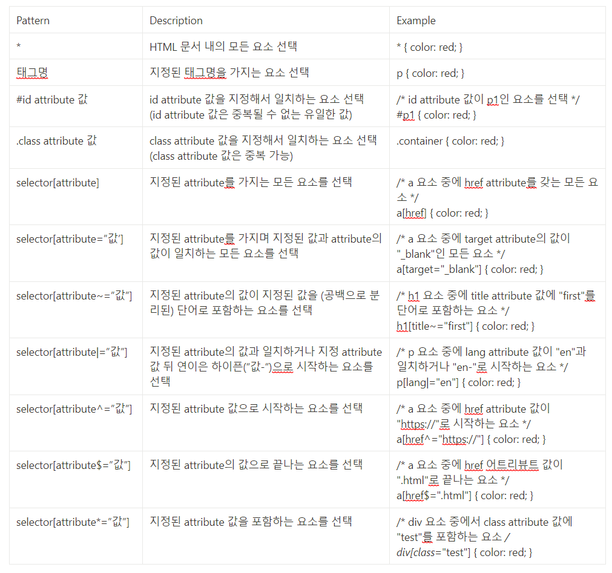

### 3. **복합 selector (Combinator)**

1. **후손 selector (Descendant Combinator)**

   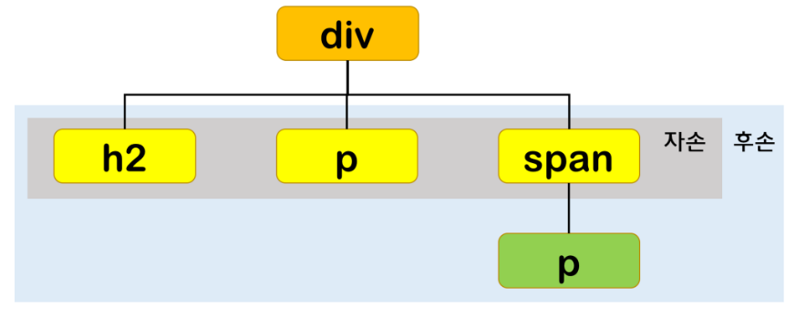

   → 부모 요소 : 자신의 1 level 상위에 속하는 요소

   → 자손 요소 (자식 요소) : 자신의 1 level 하위에 속하는 요소

   → 후손 요소 (하위 요소) : 자신의 n level 하위에 속하는 요소

   <aside>
   💡 셀렉터A 셀렉터B

   </aside>

   ```css
   /* div 요소의 후손요소 중 p 요소 */
   div p {
     color: red;
   }
   ```

   **b. 자식 selector (Child Combinator)**

   → 자손 셀렉터는 selectorA의 모든 자식 요소 중 selectorB와 일치하는 요소를 선택

   <aside>
   💡 셀렉터A > 셀렉터B

   </aside>

   ```css
   /* div 요소의 자식요소 중 p 요소 */
   div > p {
     color: red;
   }
   ```

   **c. 형제 (동위) selector (Sibling Combinator)**

   → 형제 관계(동위 관계)에서 뒤에 위치하는 요소를 선택할 때 사용

   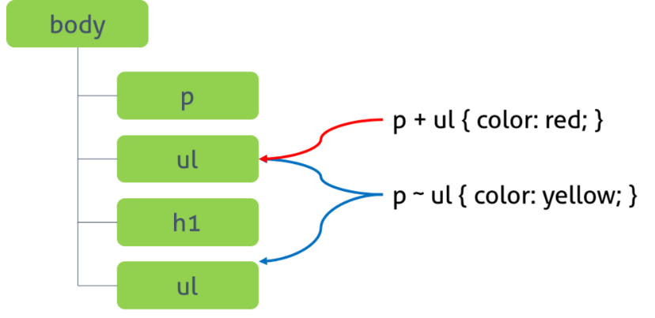

   **ㄱ. 인접 형제 셀렉터 (Adjacent Sibling Combinator)**

   → 셀렉터A의 형제 요소 중 셀렉터A 바로 뒤에 위치하는 셀렉터B 요소를 선택

   → A와 B 사이에 다른 요소가 존재하면 선택되지 XX

   <aside>
   💡 셀렉터A + 셀렉터B

   </aside>

   ```css
   /* p 요소의 형제 요소 중에 p 요소 바로 뒤에 위치하는 ul 요소를 선택한다. */
   p + ul {
     color: red;
   }
   ```

   **ㄴ. 일반 형제 셀렉터 (General Sibling Combinator)**

   → 셀렉터A의 형제 요소 중 셀렉터A 뒤에 위치하는 셀렉터B 요소를 모두 선택

   <aside>
   💡 셀렉터A ~ 셀렉터B

   </aside>

   ```css
   /* p 요소의 형제 요소 중에 p 요소 뒤에 위치하는 ul 요소를 모두 선택한다.*/
   p ~ ul {
     color: red;
   }
   ```

### 4. 가상 클래스 셀렉터 (Pseudo-class Selector)

→ 요소의 특정 상태에 따라 스타일을 정의할 떄 사용 (ex. 마우스가 올라와 있을때)

→ 원래 클래스가 존재하지 X지만, 특정 상태에는 가상 클래스를 임의로 지정하여 선택

<aside>
💡 selector:pseudo-class {
property: value;
}

</aside>

```css
/* a 요소가 hover 상태일 때 */
a:hover {
  color: red;
}
/* input 요소가 focus 상태일 때 */
input:focus {
  background-color: yellow;
}
```

### 5. 링크 셀렉터 (Link pseudo-classes), 동적 셀렉터 (User action pseudo-classes)

| pseudo-class | Description                      |
| ------------ | -------------------------------- |
| :link        | 셀렉터가 방문하지 않은 링크일 때 |
| :visited     | 셀렉터가 방문한 링크일 때        |
| :hover       | 셀렉터에 마우스가 올라와 있을 떄 |
| :active      | 셀렉터가 클릭된 상태일 때        |
| :focus       | 셀렉터에 포커스가 들어와 있을 때 |

```css
<style>
    /* a 요소가 방문하지 않은 링크일 때 */
    a:link { color: orange; }

    /* a 요소가 방문한 링크일 때 */
    a:visited { color: green; }

    /* a 요소에 마우스가 올라와 있을 때 */
    a:hover { font-weight: bold; }

    /* a 요소가 클릭된 상태일 때 */
    a:active { color: blue; }

    /* text input 요소와 password input 요소에 포커스가 들어와 있을 때 */
    input[type=text]:focus,
    input[type=password]:focus {
      color: red;
    }
    </style>
```

### 6. 구조 가상 클래스 셀렉터 (Structural pseudo-classes)

| pseudo-class | Description                                              |
| ------------ | -------------------------------------------------------- |
| :first-child | 셀렉터에 해당하는 모든 요소 중 첫번째 자식인 요소를 선택 |
| :last-chidl  | 셀렉터에 해당하는 모든 요소 중 마지막 자식인 요소를 선택 |

```css
<style>
    /* p 요소 중에서 첫번째 자식을 선택 */
    p:first-child { color: red; }

    /* p 요소 중에서 마지막 자식을 선택 */
    /* body 요소의 두번째 p 요소는 마지막 자식 요소가 아니다.
       body 요소의 마지막 자식 요소는 div 요소이다. */
    p:last-child { color: blue; }
  </style>
```

| pseudo-class       | Description                                                    |
| ------------------ | -------------------------------------------------------------- |
| :nth-child(n)      | 셀렉터에 해당하는 모든 요소 중 앞에서 n번째 자식인 요소를 선택 |
| :nth-last-child(n) | 셀렉터에 해당하는 모든 요소 중 뒤에서 n번째 자식인 요소를 선택 |

```css
/* ol 요소의 자식 요소인 li 요소 중에서 짝수번째 요소만을 선택 */
ol > li:nth-child(2n) {
  color: orange;
}
/* ol 요소의 자식 요소인 li 요소 중에서 홀수번째 요소만을 선택 */
ol > li:nth-child(2n + 1) {
  color: green;
}

/* ol 요소의 자식 요소인 li 요소 중에서 첫번쨰 요소만을 선택 */
ol > li:first-child {
  color: red;
}
/* ol 요소의 자식 요소인 li 요소 중에서 마지막 요소만을 선택 */
ol > li:last-child {
  color: blue;
}

/* ol 요소의 자식 요소인 li 요소 중에서 4번째 요소 요소만을 선택 */
ol > li:nth-child(4) {
  background: brown;
}

/* ul 요소의 모든 자식 요소 중에서 뒤에서부터 시작하여 홀수번째 요소만을 선택 */
ul > :nth-last-child(2n + 1) {
  color: red;
}
/* ul 요소의 모든 자식 요소 중에서 뒤에서부터 시작하여 짝수번째 요소만을 선택 */
ul > :nth-last-child(2n) {
  color: blue;
}
```

### 7. 부정 셀렉터 (Negation pseudo-class)

| pseudo-class | Description                             |
| ------------ | --------------------------------------- |
| :not(셀렉터) | 셀렉터에 해당하지 않는 모든 요소를 선택 |

```css
/* input 요소 중에서 type 어트리뷰트의 값이 password가 아닌 요소를 선택 */
input:not([type="password"]) {
  background: yellow;
}
```

---

## 2.3 CSS Units \_ CSS 프로퍼티 값의 단위

→ px는 절대값, em / %는 상대값

### 1. px : 픽셀 단위

→ 요소의 크기나 이미지의 크기 지정에 주로 사용됨

```css
font-size: 14px;
```

### 2. % : 요소의 지정된 사이즈에 상대적인 사이즈를 설정

```css
body {
  font-size: 14px;
}
div {
  font-size: 120%; /* 14px * 1.2 = 16.8px */
}
```

---

## 2.4 CSS Box Model \_ 박스 모델

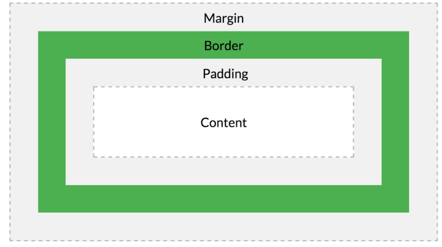

| Content | 요소의 텍스트나 이미지 등의 실제 내용이 위치 (width, height의 property 有) |
| ------- | -------------------------------------------------------------------------- |
| Padding | Border(테두리) 안에 위치하는 요소의 내부 여백 영역                         |
| Border  | 테두리 영역                                                                |
| Margin  | 테두리 바깥에 위치하는 요소의 외부 여백 영역                               |

### 1. width / height property

→ content 영역의 너비와 높이를 지정하기 위해 사용됨

<aside>
💡 **전체 너비**

width + left padding + right padding + left border + right border + left margin + right margin

</aside>

<aside>
💡 **전체 높이**

height + top padding + bottom padding + top border + bottom border + top margin + bottom margin

</aside>

### 2. margin / padding property

1. content의 4개 방향 (top, right, left, bottom) 에 대해서 지정이 가능

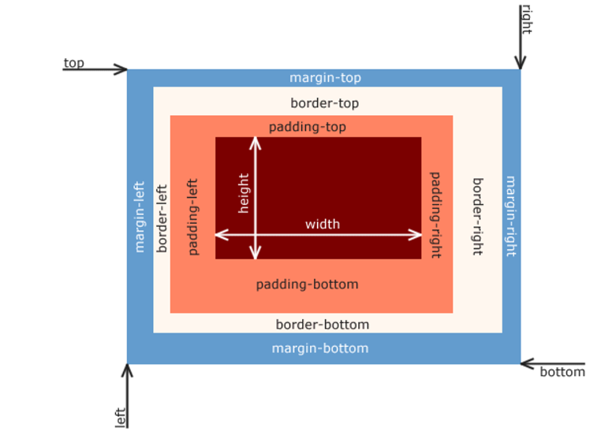

1. margin property에 ‘**auto**’ 키워드를 설정하면, 해당 요소를 브라우저의 중앙에 위치 시킬 수 有
2. max-width property : 요소 너비가 브라우저 너비보다 클 때 가로 스크롤 바가 안 만들어지게 함

```css
<style>
      div {
        border: 5px solid red;
        max-width: 600px;
        margin: auto;
      }
    </style>
```

<aside>
💡 max-width property를 사용하면 브라우저 너비가 요소의 너비보다 좁아질 때, 자동으로 요소의 너비가 줄어든다.

</aside>

### 3. border property

### 3.1 border-style

→ 테두리 선의 스타일을 지정

→ property 값의 갯수에 따라 4개 방향 (top, right, left, bottom)에 대해서 지정이 가능

### 3.2 border-width

→ 테두리의 두께를 지정

→ property 값의 갯수에 따라 4개 방향 (top, right, left, bottom)에 대해서 지정이 가능

<aside>
💡 border-width property는 border-style과 함께 사용하지 않으면 적용되지 X

</aside>

### 3.3 border-color

→ 테두리의 색상을 지정

→ property 값의 갯수에 따라 4개 방향 (top, right, left, bottom)에 대해서 지정이 가능

<aside>
💡 border-color property는 border-style과 함께 사용하지 않으면 적용되지 X

</aside>

### 3.4 border-radius

→ 테두리 모서리를 둥글게 표현하도록 지정

```css
border-radius: 20px;
```

### 3.5 border

→ border-width, border-style, border-color를 한번에 설정하기 위한 빠른 property

<aside>
💡 border: border-width border-style border-color;

</aside>

```css
/* border-width border-style border-color */
border: 5px solid red;
```

---

## 2.7 CSS Font & Text \_ 폰트와 텍스트

### 1. font-size property

```css
font-size: 40px;
```

### 2. font-family property

→ 폰트를 지정해주는 요소

### 3. font-style / font-weight property

1. font-style : 이틸릭체의 지정
2. font-weight : 폰트 굵기 지정

### 4. letter-spacing property

→ 글자 사이의 간격을 지정

```css
.loose {
  letter-spacing: 2px;
}
.tight {
  letter-spacing: -1px;
}
```

---

## 2.8 CSS Position \_ 요소의 위치 정의

→ **Position** : 요소의 위치를 정의 / top, bottom, right, left의 property와 함께 사용하여 위치를 지정

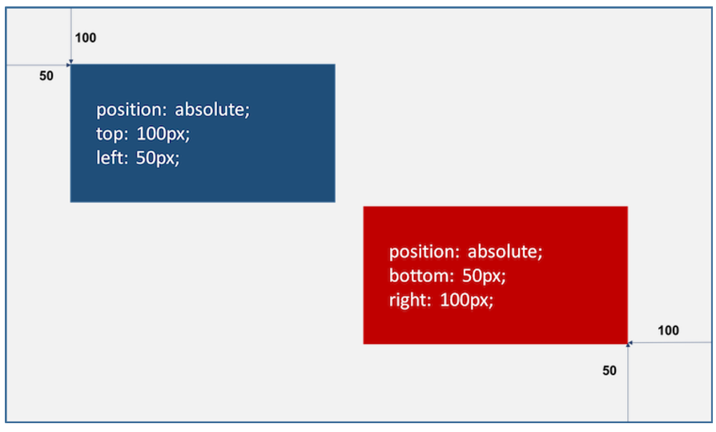

### 1.1 static (기본 위치)

1. position property의 기본 값 : position property를 지정하지 않았을 때와 같음
2. 좌표 property (top, bottom, left, right)를 같이 사용할 수 X며, 사용될 경우 무시됨
3. 기본적인 요소의 배치 순서에 따라, 위에서 아래로 / 왼쪽에서 오른쪽으로 순서에 따라 배치됨

### 1.2 relative (상대 위치)

→ 기본 위치 (static으로 지정되었을 때의 위치)를 기준으로 top, bottom, left, right를 사용하여 위치를 이동

### 1.3 absolute (절대 위치)

→ 부모 요소 / 가장 가까이 있는 조상요소(static 제외)를 기준으로 top, bottom, left, right 만큼 이동

<aside>
💡 부모요소를 배치의 기준으로 삼기 위해서는 부모 요소에 relative를 정의해야함!

</aside>

### 1.4 fixed (고정 위치)

→ 부모 요소와 관계없이, 브라우저의 viewpoint를 기준으로 top, bottom, left, right를 사용하여 이동

→ 스크롤이 되더라도 화면에서 사라지지 X고 항상 같은 곳에 有

---

## 2.9 CSS Float \_ 요소 정렬

→ float property : 레이아웃을 구성 시, 블록 레벨 요소를 가로 정렬하기 위해 사용되는 중요한 기법

→ 아래 그림 예시처럼, 이미지와 텍스트가 있을때, 이미지 주위를 텍스트로 감싸기 위해서 만들어짐

```css
<!DOCTYPE html>
<html>
<head>
  <style>
    img {
      float: left;
      margin-right: 10px;
    }
  </style>
</head>
<body>
  
  <div>Lorem ipsum dolor sit amet, consectetur adipisicing elit, sed do eiusmod tempor incididunt ut labore et dolore magna aliqua. Ut enim ad minim veniam, quis nostrud exercitation ullamco laboris nisi ut aliquip ex ea commodo consequat. Duis aute irure dolor in reprehenderit in voluptate velit esse cillum dolore eu fugiat nulla pariatur. Excepteur sint occaecat cupidatat non proident, sunt in culpa qui officia deserunt mollit anim id est laborum.Lorem ipsum dolor sit amet, consectetur adipisicing elit, sed do eiusmod tempor incididunt ut labore et dolore magna aliqua. Ut enim ad minim veniam, quis nostrud exercitation ullamco laboris nisi ut aliquip ex ea commodo consequat. Duis aute irure dolor in reprehenderit in voluptate velit esse cillum dolore eu fugiat nulla pariatur. Excepteur sint occaecat cupidatat non proident, sunt in culpa qui officia deserunt mollit anim id est laborum.</div>
</body>
</html>
```

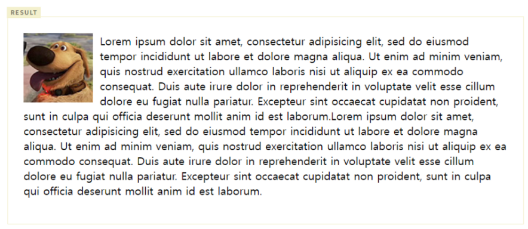

| none  | 요소를 떠 있게 하지 X (기본값) |
| ----- | ------------------------------ |
| right | 요소를 오른쪽으로 이동         |
| left  | 요소를 왼쪽으로 이동           |

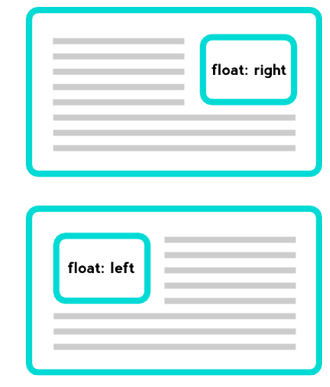

### 1.1 정렬

1. **float:left;** 를 사용시, 왼쪽부터 가로로 정렬
2. **float:right;** 를 사용시, 오른쪽부터 가로로 정렬
